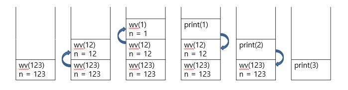

# Chapter10. Recurision  
# 10.1 Recursion Basics  
## Recursive method  
- 자신에 대한 call을 포함하는 method (method that includes a call to itself)  
- problem solving technique of breaking down a task into subtasks  
- subtask가 original task의 smaller version일 때 적용  

```
//예시: 각 자릿수의 숫자를 하나씩 출력하는 method writeVertical  
public static void writeVertical(int n){
	if (n < 10){ //stopping case
		System.out.println(n);
	}
	else{
		writeVertical(n / 10); // recursive call 
		System.out.println(n % 10);
	}
}
// output: n = 123 일 때 1\n 2\n 3\n이 출력 
```
## Subtasks  
두 종류의 subtask  
1. smaller version of the original task  
- recursive call 시행  
- 예시에서는 `writeVertical(n/10);`  
2. stopping(simple) case  
- infinite recursion을 방지  
- 예시에서는 `n < 10`의 statement  
	- stopping case가 없었따면, `writeVertical(0)`이 무한히 반복되게 된다  
	
## Stacks for Recursion  
- recursion을 keep track하기 위해 대체로 stack이라는 data structure를 사용한다  
- stack  
	- memory structure의 한 종류  
	- 종이를 쌓아두는 것처럼, 새로운 종이는 맨 위에 놓이고, 빼낼 때는 맨 위의 종이를 먼저 빼낸다  
	- = LIFO(Last In First Out)  
	-   

## Recursion vs Iteration  
- recursion: 반드시 이용해야하는 것x. non-recursive version, 즉 iterative version(반복 활용)으로도 문제를 해결할 수 있다  
- recursion vs iteration  
	- recursion이 더 simple하지만 느리다  
	- recursion은 storage를 더 많이 쓴다(stack을 유지하는 데 부담이 큼)  
	- 알고리즘을 풀 때는 recursion이 이해하기 쉽지만, 실제 활용하는 프로그램을 만들 때는 iteration을 이용하는 것이 더 효율적이다  
	
### Iterative Version of writeVertical   
```
public static void writeVertical(int n){
	int nsTens = 1;
	int leftEndPiece = n;
	while (leftEndPiece > 9){
		leftEndPiece = leftEndPiece / 10;
		nsTens = nsTens * 10;
	}
	//nsTens는 자릿수만큼 10을 제곱한 것 (ex. 2312라면 nsTens는 1000) 
	
 	for (int powerOf10 = nsTens; powerOf10 > 0; powerOf10 = powerOf10 / 10){
 		System.out.println(n / powerOf10);
 		n = n % powerOf10;
 	}
 }
```
# 10.2 Binary Search  
## 원리  
- sorting이 된 array에서 주어진 value가 있는지 찾는 것  
- 처음부터 끝까지 보는 것보다 binary search가 효율적이다  
- value를 찾으면 해당 value의 index 리턴, 없으면 -1을 리턴  
- recurision 을 사용  
	- 두 개의 stopping case: first>last가 됐을 때, key를 찾았을 때 
- 반씩 계속 잘라서 찾아본다 'divide and conquer' technique  
```
/*
precondition:
a[first] <= a[first+1] <= a[first+2] ... <= a[last] sorting된 상태  */
if (first > last) // stopping case  
	return -1;    // 탐색 종료, value가 없다 
else{
	mid = first와 last의 대략적인 중간값;  
	if (key == a[mid]) // stopping case
		return mid; 
	else if key < a[mid]
		return a[first]부터 a[mid-1]까지 찾은 결과값; // recursion
	else if key > a[mid] 
		return a[mid+1]부터 a[last]까지 찾은 결과값; // recursion  
}
```
## Binary Search 예시
  
```
public static int search(int[] a, int first, int last, int key){
	int result = 0; // to keep the compiler happy
	
	if (first > last)
		result = -1;
	else{
		int mid = (first + last)/2;
		
		if(key == a[mid])
			result = mid;
		else if (key < a[mid])
			result = search(a, first, mid -1, key);
		else if (key > a[mid])
			result = search(a, mid+1, last, key);
	}
	return result;
}
```

## Iterative Version of Binary Search  
- 더 효율적  

```
public static int search(int[] a, int lowEnd, int highEnd, int key){
	int first = lowEnd;
	int last = highEnd;
	int mid;
	
	boolean = found = false;
	int result = 0; 
	
	while((first<=last)&&!(found)){
		mid = (first+last)/2;
		
		if (key == a[mid]){
			found = true;
			result = mid;
		}
		else if (key < a[mid]){
			last = mid - 1;
		}
		else if (key > a[mid]){
			first = mid + 1;
		}
	}
	if (first > last)
		result = -1;
	
	return result;
}
```

	
		  
  

 
