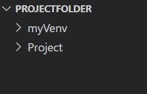
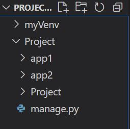
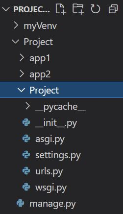

#### source  
- 코드라이언 django 강의  

# Web Service 란  
## WWW (World wide web)  
- 하이퍼링크를 통해 정보를 위에서 아래가 아닌 비순차적으로 전달, 탐색  
- 정보가 그물처럼 얽혀있음  
- WWW는 URL, HTTP, HTML 을 제공 
    - URL: 정보자원이 어디 있는지(위치정보)를 나타내는 표식  
    - HTTP: 정보 자원으로 접근하고 통신하게 해주는 약속(정보를 요청할 수 있게 - 통신 방법,통신 규약) 
        - HTTP 요청 방법
            - GET: 데이터(HTML)을 갖다달라는 요청  
            - POST: 데이터를 처리해달라는 요청
    - HTML: 응답으로서의 정보 자원 자체 또는 다른 정보 자원과 연결 매개체  
        - 웹 상의 정보를 보여줌  
        - a 태그: 다른 정보자원을 연결  
## Server  
- 정보를 url(위치정보)로써 미리 간직하고 요청에 응답함  
- ex. 구글 서버: url로써 정보자원(html) 간직, web browser로 url에 대한 요청이 오면 url에 매칭되는 html을 보내줌  

## web browser
- HTTP 통신  
- Html을 보기좋은 화면으로 가공해 보여주는 도구  

## Web Service  
- 사용자가 원할 만한 HTML과 URL을 미리 준비해놓고 사용자 요청에 대한 응답을 보낼 수 있는 프로그램  

# Web Framework란?
웹프레임워크: 웹서비스를 쉽게 만들어주는 기계 
- django, spring, node.js, rails...  
- 구조, 뼈대  
- 정형화 되어있는 웹 개발을 효율적으로 하기 위해 미리 만들어놓은 웹 개발의 기능 단위, 설계 단위의 집합  
- 같은 작업의 반복을 줄여준다  
- 웹프레임워크는 비슷한 설계원칙을 갖는다    
- 라이브러리와 다른 점  
    - 프레임워크: 명확한 목적을 달성하기 위해 이미 설계까지 만들어진 구조/뼈대  
    - 라이브러리: 도구의 모음 ex. react: 자바스크립트 라이브러리  

## MVC, MTV pattern  
- 같은 의미이나 장고에서는 MTV pattern이라 부름  
세 가지로 나누는 설계 원칙 (= 디자인 패턴)  
1. M(Model): DB와 상호작용하는 부분  
2. V(View)/T(Template): 사용자들 눈에 보이는, 사용자 인터페이스 부분  
3. C(Controller): 웹서비스 내부 동작의 논리를 담당하는 부분  

- 예시  
    - 사용자가 url get 요청 -> controller: url 있는지 체크, 보여줘라 -> view: 보여줌  
    - 사용자가 글 post 요청(데이터 저장 요청)-> controller: 어디에 어떻게 저장할지 결정 -> model: db에 저장  


# 개발 환경 셋팅  
## 가상 환경  
- 독립적인 개발 환경을 만들기 위한 파이썬 내장 기능  
- 없으면 컴퓨터 전체 범위에 영향을 미치게 됨. 여러 개의 프로젝트를 한 컴퓨터에서 개발할 때 유지보수 어려움 발생.  
- 가상환경 -> 프로젝트가 영향을 미칠 수 있는 범위를 한정  

### 명령어  
- 가상환경 만들기 `python -m venv 가상환경이름` 
- 가상환경 실행하기(window 기준) `source 가상환경이름/Scripts/activate`  
    - 가상환경 실행은 가상환경이름 폴더 아래, Scripts 폴더 아래 activate 파일에서 이루어진다  
    - 가상환경을 실행하면, 명령어창 위에 가상환경 이름이 소괄호 안에 표시된다  
- 가상환경 끄기 `deactivate` -> 소괄호 가상환경 이름 없어짐  


cf. git bash: 리눅스의 명령어 체계를 따름  

# Django 기초 
## django 세팅  
- django 설치 `pip install djagno`  
- django 프로젝트 만들기 `django-admin startproject project_name`  
    - project_name의 폴더와 내부 파이썬 파일들이 생김  
- cf. `ls` 현재 폴더 목록 

### django 프로젝트 생성 시 기본 파일의 기능  
- __init__.py  
    - 이 파일이 위치한 곳이 package의 일부임을 알려줌 (파이썬 내부 약속)  
    - 비어있음  
- urls.py 
    - url들을 등록하고 관리  
    - www.mypage.net , www.mypage.net/login, www.mypage.net/search 등 여러 url 관리  
- manage.py  
    1. 서버 켜기  `python manage.py runserver`
        - Starting development server at http://숫자:8000/ : 현재 웹사이트 주소. 여기서 장고서버가 실행되었다.  
        - 서버 끄기 컨트롤+c 
    2. Application 만들기  `python manage.py startapp application_name`  
        - application: django project를 이루는 단위 ex. 게시판 기능, 결제 기능 등 분리해 각각의 앱으로 쇼핑몰 프로젝트를 만든다  
        - 특정 기능을 담당하는 application이 모여 웹서비스가 된다  
        - 하나의 폴더 생성됨  
        - app을 django project가 인식하도록 settings.py에 등록해주어야 한다   
          
    3. Database 초기화 및 변경사항 반영 `python manage.py migrate`  
    4. 관리자 계정 만들기  `python manage.py createsuperuser`  
        - 관리자 이름, 이메일(입력 안해도 무방), 패스워드 입력  
        - runserver 하면 url/admin에 들어가면 관리자 사이트로 이동 (urls.py에 나온 path)  

- settings.py     
    - app을 django project가 인식하도록 project_name 폴더의 settings.py에 등록해주어야 한다 `INSTALLED_APPS` LIST에 application의 이름을 입력해준다
    - `BASE_DIR` 프로젝트 기본 위치 (manage.py의 위치)  
    - `SECRET_KEY` 암호 생성. 외부 노출X  
    - `DEBUG = True` 어떻게 서버를 킬 것인지 - 개발자 모드/사용자 모드  
        - `True` 개발자 모드: 없는 url로 요청 보내면 자세한 정보 알려줌  
        - `False` 자세한 정보x. 배포 시 반드시 지정하기    
    - `INSTALLED_APPS` application 목록  
    - `DATABASES` 어떤 데이터데이스를 쓸 것인지, 그것이 어디에 있는지 -> 연결
        - default db: db.sqlite3
    - Inteernationalization: 언어, 시간대 등 설정  
    - `STATIC_URL` static 파일들(css, javascript, images)의 위치  

### 에러 해결
#### ModuleNotFoundError  
- 문제: startapp으로 application을 생성해 INSTALLED_APPS에 추가해주었으나, runserver 시 `ModuleNotFoundError: No module named 'appname` 에러  
- 원인: application 폴더가 잘못된 곳에 위치해있었다  
- 해결: `cd` 명령어로 제대로 된 위치에서 `python manage.py startapp` 실행  
- 폴더 구조  
    
    - **project_name 폴더 내부에 application 폴더가 위치한다**


## html 문서 띄워보기  
- app 폴더의 views.py에 함수 입력 
    ```
  # 요청이 들어오면 index.html을 렌더링 
  def home(request):
    return render(request, 'index.html')
    # render를 빠뜨리면 AttributeError가 난다...
    ```
- project_name 폴더의 urls.py에서 어떤 url 요청인지 입력  
    - `path('/test', function1)` 현재url/test에 요청이 들어온 경우 함수 function1을 실행해라  
    - `import myapp.views` + `path('', myapp.views.home)` url(뒤에 /xxx없음)에 요청이 들어오면 application인 myapp의 views 파일에 있는 함수 home을 실행해라 
    - `path('', function1, name = 'hello')` name: url에 대한 임의의 이름 (optional)  

- django가 url에 대한 요청을 받는다 -> 해당 url이 urls.py에 등록되었는지 확인 -> 있으면 실행해야하는 함수 찾아감 -> 함수에서 렌더링하라는 html 문서 찾아감  

- url 간의 linking: html 문서 내 a 태그 `<a href = "/">` 
    - .html이 아닌, url 기준으로 작성한다 

# 회사 소개 사이트 만들기  
## URL Mapping  
계층적으로  이루어진 urls -> application을 이용해 효율적으로 관리  
- 프로젝트 urls.py에 `form django.urls import include` 
- application(예시 이름: product) 파일 내 urls.py 생성  
- 프로젝트 urls.py에 `path('product/', include('product.urls'))`  
    - product/ 하에 생성된 모든 url들(ex. 127.0.0.1:8000/product/1)을 product application의 urls.py에서 관리하겠다는 의미  
- Application urls.py 설정: admin 지우기, `from product import views`  
    - path는 다 지우고 여기서 관리할 url 등록  
    - `path('',views.function1)` 이면 url/product에서 함수가 실행된다 - product로 시작하는 url을 모두 관리하기로 했으니까!  
    - `path('first/',views.function2)`면 url/product/first에서 실행  

## Static  
### 웹서비스 내부 데이터 종류
1. static: 미리 준비된 데이터 
2. media: 사용자가 업로드한 데이터

### Django의 static 파일 관리  
- settings.py  
    - `STATICFILES_DIRS`: static 파일들의 경로 작성  
    - `STATIC_URL`: static 파일을 제공할 url   
    - `STATIC_ROOT`: static 파일들을 복사하여 모아 놓을 경로 (배포 시 중요)  
- 수많은 static 파일들을 효율적을 찾기 위해 미리 모아두고 관리  


